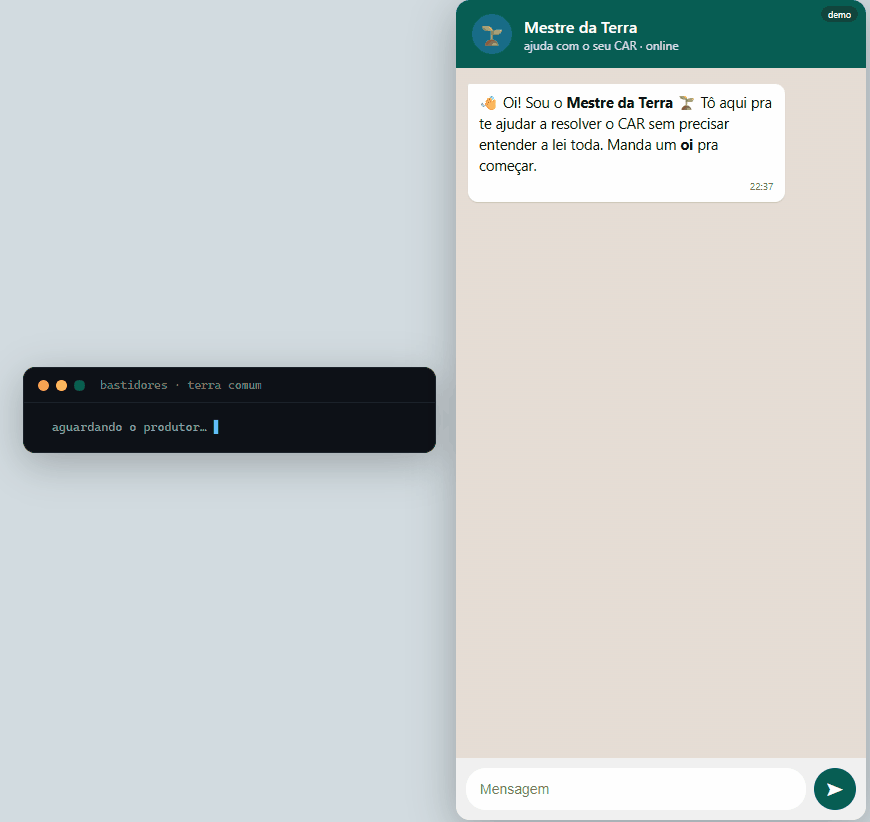

<p align="center">
  
</p>

<p align="center">
  
</p>

<p align="center"><em>O território já tinha fronteiras. Faltava a linguagem para lê-las.</em></p>

Protocolo aberto de agentes especializados sobre um grafo de conhecimento compartilhado
do território rural brasileiro — construído sobre o RER open-source do governo federal.

**Demo online →** [lorenzzo-urso.github.io/CarFramework/hub.html](https://lorenzzo-urso.github.io/CarFramework/hub.html)

---

---

## O problema

> *"Você consegue dizer onde começa a Reserva Legal da sua propriedade?"*
>
> O Seu Raimundo também não. E é por isso que **8,2 milhões de produtores**
> vivem com medo de errar o CAR.

O CAR existe. Os dados ambientais existem. O Código Florestal existe.
Mas estão fragmentados, em linguagem técnica, atrás de portais que o produtor
rural não consegue usar. **O problema não é falta de informação — é falta de contexto.**

---

## A transformação

<p align="center">
  
</p>

**Antes:** Seu Raimundo recebe uma notificação — *"sobreposição de polígono em área de APP,
necessária retificação cadastral"*. Não entende uma palavra. Guarda na gaveta.
O crédito rural fica bloqueado.

**Depois:** Manda "oi" pro **Compadre** no WhatsApp. O Compadre leu a notificação por ele:
*"Acharam uma diferença na área perto do seu rio. É isso aqui, ó. Pra resolver,
é só confirmar esse limite no mapa — eu já deixei quase pronto."*
Em minutos, entendeu, corrigiu — e descobriu que o CAR em dia libera o Pronaf Eco.

---

## Como funciona

A solução tem duas faces que trabalham juntas:

| | |
|---|---|
| **Compadre** | O agente que o produtor vê — conversa pelo WhatsApp, traduz pendências, explica as regras, descobre problemas antes da fiscalização. |
| **Terra Comum** | O motor que ninguém vê — ontologia do Código Florestal + grafo de conhecimento + Agent Hub, sobre o RER open-source. É o que garante que a resposta seja rastreável, não inventada. |

Princípio: **esconde a máquina pesada. Ensina só o essencial.**

---

## A arquitetura

```
FONTES ABERTAS
  SICAR · MapBiomas · SIGEF · SFB · ANA · IBGE · SNIF
       │
       ↓  normalização semântica
       │
  TERRA COMUM  ◄─── a camada que não existia
  ┌─────────────────────────────────────────────┐
  │  Ontologia do território                    │
  │  APP · RL · biomas · CF · benefícios        │
  │                                             │
  │  Agent Hub  (protocolo aberto · YAML)       │
  │                                             │
  │  Análise própria                            │
  │  geometria + regra + dado aberto            │
  └─────────────────────────────────────────────┘
       │
       ↓  agentes especializados
       │
  ┌──────────┬──────────┬──────────┬──────────┐
  │ Compadre │ Auditor  │ Crédito  │  [+N]    │
  │ produtor │  OEMA    │  banco   │  qualquer │
  └──────────┴──────────┴──────────┴──────────┘
       │
       ↓  canal agnóstico
       │
  WhatsApp · app de banco · portal · API · qualquer mensageiro
```

A ontologia é o contrato. Quando a lei muda, você muda um nó — todos os agentes
ficam corretos automaticamente. Nenhum chatbot existente faz isso.

---

## Screenshots

<p align="center">
  
  &nbsp;&nbsp;
  
  <br/><sub>Compadre em ação — conversa real com o Mestre da Terra</sub>
</p>

<p align="center">
  
  <br/><sub>Agent Hub — catálogo de agentes especializados</sub>
</p>

<p align="center">
  
  <br/><sub>Territórios — visualização CAR de 8 imóveis com status em tempo real</sub>
</p>

<p align="center">
  
  <br/><sub>Protocolo — arquitetura em camadas e fontes de dados abertas</sub>
</p>

---

## O que está rodando hoje

O PoC foi construído durante o haCARthon com geometria real de MG (Alvinópolis, 41,7 ha).

A plataforma funciona em dois modos:

### Modo estático — [demo online](https://lorenzzo-urso.github.io/CarFramework/hub.html)

Disponível sem instalar nada. Tudo que é visual e navegável:

| Disponível | |
|---|---|
| Agent Hub completo | 6 páginas navegáveis — Agentes, Protocolo, Governança, Ecossistemas, Docs, DPG |
| Cards dos 7 agentes | com detalhes, ferramentas e rastreabilidade de cada um |
| Mapa territorial | 8 imóveis rurais com status de CAR (conforme / déficit / pendente) |
| Arquitetura e fontes | documentação das 5 bases de dados abertas e 8 conceitos da ontologia |
| Interface do Compadre | chat simulado com resposta de demonstração pré-carregada |

### Modo completo — com backend local

Com `uvicorn` rodando, tudo acima **mais**:

| Desbloqueado | |
|---|---|
| Compadre ao vivo | conversa real com Claude Haiku 4.5, grounded na ontologia |
| Análise de APP em tempo real | geometria real × ontologia → déficit calculado na hora |
| Delegação automática | Professor responde conceptual; Compadre responde sobre o imóvel |
| Badge "ao vivo" no Hub | confirma que o backend está conectado |
| `/docs` interativo | Swagger UI com todos os schemas e exemplos executáveis |

### Os agentes do Hub

| Agente | Para quem |
|---|---|
| `compadre` | Produtor rural — entende, declara, corrige o CAR |
| `professor` | Explica o Código Florestal em linguagem livre |
| `auditor` | Analistas dos OEMAs — parecer técnico, ciclo de retificação |
| `territorial` | Governo — déficit de RL por município, áreas críticas |
| `credito` | Cooperativas e bancos — carteira elegível, crédito verde |
| `oportunidades` | PSA, CRA, Pronaf Eco — descobre o que o CAR regular libera |
| `comunicador` | OEMAs e prefeituras — notificações em linguagem humana |

---

## O diferencial que importa

A resposta óbvia ao problema é um chatbot que ajuda o Raimundo. Essa resposta já existe.
Nós entregamos outra coisa.

**1. Raciocina sobre ontologia — não sobre texto.**
Não é RAG. Não é prompt com PDF do Código Florestal colado.
A lei está no grafo. A resposta é derivada — verificável, auditável, corrigível.
Não existe implementação pública de ontologia para o CAR. Somos os primeiros.

**2. Protocolo, não produto.**
1 camada semântica → N agentes → N personas.
O custo marginal de um novo agente é o custo de um manifesto YAML.
O Compadre (produtor), o Auditor (OEMA), o Crédito (cooperativa) rodam todos
sobre o mesmo conhecimento — benefícios individuais *e* coletivos em uma única arquitetura.

**3. Sobre a infraestrutura do governo.**
Construído sobre o RER open-source e as bases abertas do SFB.
Não recriamos do zero — ampliamos com inteligência semântica o que já existe.
Qualquer estado, órgão ou país pode instalar e adaptar.

---

## O teto

O teto real não é o CAR.

É qualquer decisão que dependa de entender um território: concessão de crédito,
precificação de carbono, licenciamento ambiental, seguro agrícola, compra de terra,
política pública de uso do solo.

A ontologia vira o sistema nervoso.
Os agentes viram os órgãos.
As fontes de dados viram os sentidos.

**É infraestrutura cognitiva do território.**

---

## Números

| | |
|---|---|
| Imóveis no CAR | 8,2 milhões |
| Área mapeável | 7 milhões de km² |
| Crédito rural (Pronaf) | R$ 15 bi/ano |
| CARs com erros estimados | 30–40% |
| Custo de um novo agente | 1 manifesto YAML |
| Dados necessários | já públicos e abertos |

---

## Como rodar localmente

```bash
git clone https://github.com/lorenzzo-urso/CarFramework.git
cd CarFramework
```

**Só o frontend (modo estático):**
```bash
cd poc/web
python -m http.server 3000
# Abre em http://localhost:3000  →  Hub com dados de demonstração
```

**Frontend + backend (modo completo):**
```bash
# terminal 1 — backend
cd poc/backend
python -m venv .venv && .venv\Scripts\activate
pip install -r requirements.txt
uvicorn api:app --reload --port 8000

# terminal 2 — frontend
cd poc/web
python -m http.server 3000
```

| URL | O que abre |
|---|---|
| `http://localhost:3000` | Hub — página inicial |
| `http://localhost:3000/compadre.html` | Chat do Compadre |
| `http://localhost:8000/docs` | Swagger UI da API |

> Com o backend no ar, o Hub exibe o badge **"ao vivo"** e todas as respostas
> são geradas em tempo real. Sem backend, o Hub cai automaticamente para o
> modo demonstração — mesma aparência, dados pré-carregados.

---

## Estrutura do repositório

```
01-produto/     visão do produto, narrativa, encaixe no Desafio 1
02-pesquisa/    persona Seu Raimundo, os 3 gargalos, validação com produtores
03-frameworks/  value proposition, jornada do usuário, lean canvas
04-arquitetura/ arquitetura em camadas, viabilidade técnica
05-entregas/    as 3 entregas do haCARthon + PRD do PoC
06-referencias/ bases de dados abertas, resumo do edital
poc/            código — backend Python/FastAPI, frontend HTML/JS, agentes YAML
```

---

## Open-source · Bem Público Digital

O núcleo (ontologia + Agent Hub) está publicado com licença aberta.
Qualquer cooperativa, OEMA, banco ou prefeitura pode escrever um manifesto YAML
e ter um agente especializado consumindo a mesma base de conhecimento.

A ontologia hoje cobre o Código Florestal brasileiro.
Outros países podem criar a ontologia do seu código ambiental e usar o mesmo Hub.

---

*Equipe 229 · haCARthon — Desafio 1 · MGI · FBDS · ENAP · Impact Hub Brasil*
